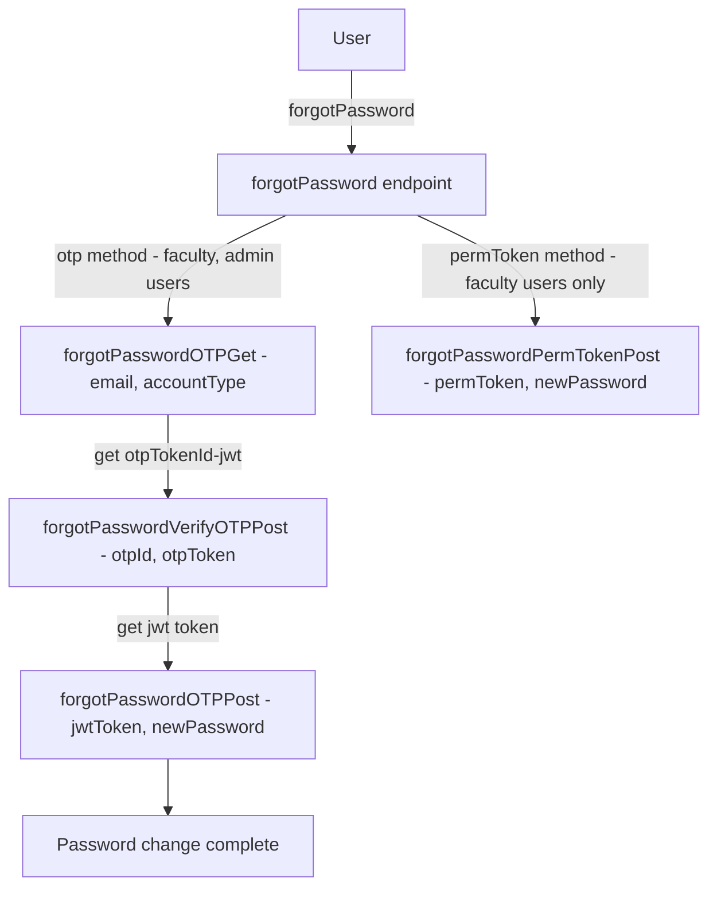
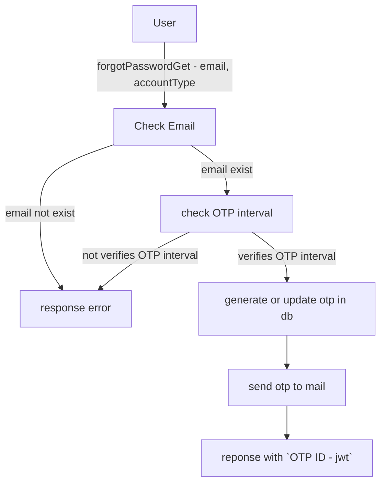
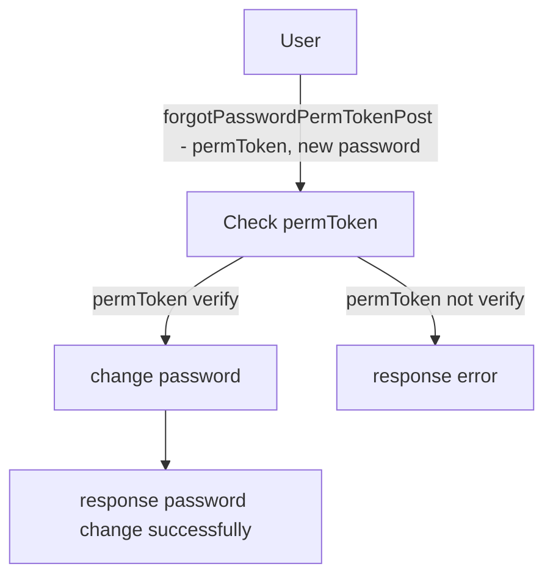
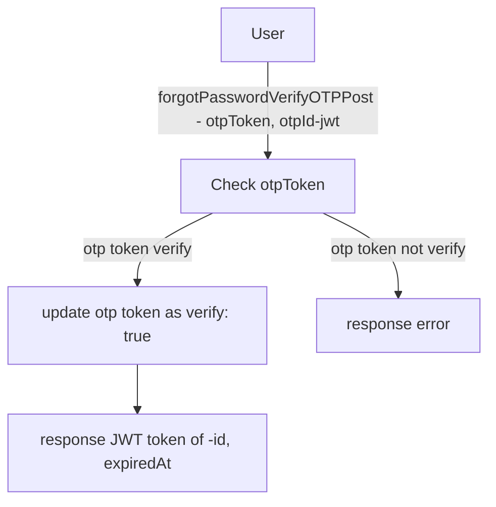
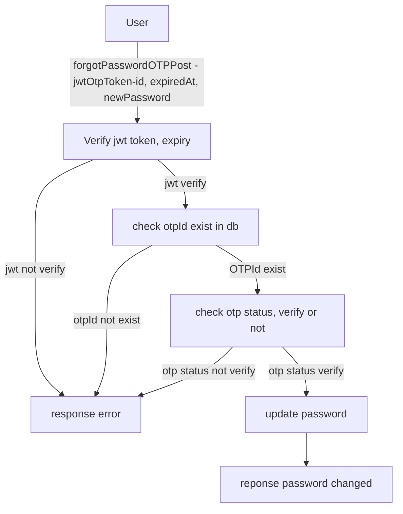
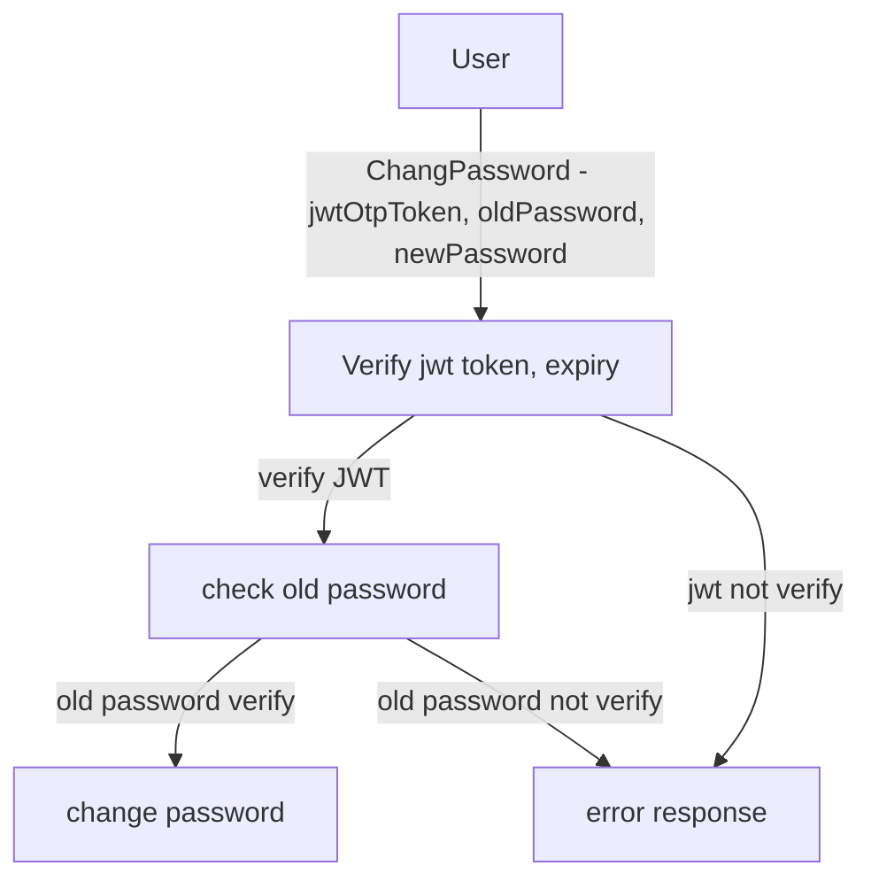

## Working of `forgot password` function for both faculty and admin using OTP and perm token

#  Authentication System flowchart - High level

---

## Controller - Detailed Working
1. `forgotPasswordOTPGet`:

2. `forgotPasswordPermTokenPost`:

3. `forgotPasswordVerifyOTPPost`:

4. `forgotPasswordOTPPost`:

#  Change Password Controller - flowchart

